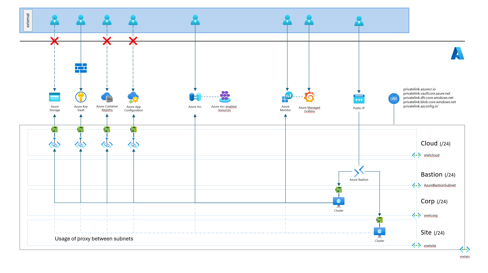

# Azure Edge Extensions AIO IaC Bicep with ISA95 network model

Infrastructure as Code (IaC) Bicep to install Azure IoT Operations (AIO) components in a simulated ISA-95 environment, with L3 (site/factory layer) and L4 (corp layer). ISA-95 is an international standard for developing an automated interface between enterprise and control systems. It provides a framework for integrating business and manufacturing systems, ensuring seamless communication and data exchange across different levels of the organization.

## Features

This project framework provides the following features:

* Provision VMs for Kubernetes (k3s) and Azure IoT Operations
* Optionally provision VMs for using Squid proxy between layers
* Install K3s, Arc, and Azure IoT Operations in a simulated ISA-95 environment
* Enable observability to consult telemetry in Azure Managed Grafana



## Getting Started

### Prerequisites

* (Optionally for Windows) [WSL](https://learn.microsoft.com/windows/wsl/install) installed and setup.
* [Azure CLI](https://learn.microsoft.com/cli/azure/install-azure-cli) available on the command line where this will be deployed.

You can also use the dev container included in this repository for a consistent development environment.

To use the dev container:

1. Install [Visual Studio Code](https://code.visualstudio.com/).
2. Install the [Remote - Containers](https://marketplace.visualstudio.com/items?itemName=ms-vscode-remote.remote-containers) extension.
3. Open the repository in Visual Studio Code.
4. When prompted, reopen the repository in the container.

This setup ensures that all necessary dependencies and tools are available.

### Quickstart

0. Sign into Azure using Azure CLI

    ``` bash
    cd ./infrastructure/scripts/azure
    az login
    ```

1. Execute the following command to verify if all requirements are met.

    ``` bash
    cd ./infrastructure/scripts/azure
    ./deploy-infra-main.sh -e development --install-requirements
    ```

2. Prior to proceeding to next step, please execute the following command manually:

    ```bash
    export CUSTOM_LOCATIONS_RP_OBJECT_ID=$(az ad sp show --id bc313c14-388c-4e7d-a58e-70017303ee3b --query id -o tsv)
    ```

3. Execute the following command to deploy the infrastructure:

    This command deploys the necessary infrastructure for networking, fundamental services (such as app configuration and key vault), cluster virtual machines with Kubernetes (k3s distribution), and integrates the clusters into Azure Arc. Azure IoT Operations is not installed at this stage.

    ```shell
    ./deploy-infra-main.sh -e development -o $CUSTOM_LOCATIONS_RP_OBJECT_ID
    ```

    If you want to deploy the infrastructure with a proxy between the site at level 3 (Site) and level 4 (Corp), and a proxy between level 4 (Corp) and level 5 (Cloud), run the command below instead. The proxy solution used in this demo relies on [Squid](https://www.squid-cache.org/).

    ```shell
    ./deploy-infra-main.sh -e development -o $CUSTOM_LOCATIONS_RP_OBJECT_ID --install-proxy
    ```

4. Finally, once the clusters are installed and enrolled into Azure Arc, you can deploy Azure IoT Operations:

    ```shell
    ./deploy-infra-main.sh -e development --install-iot-operations
    ```

## Resources

* [How to deploy Infrastructure](./docs/installation.md)
* [Infrastructure Fundamentals](./docs/infrastructure.md)
