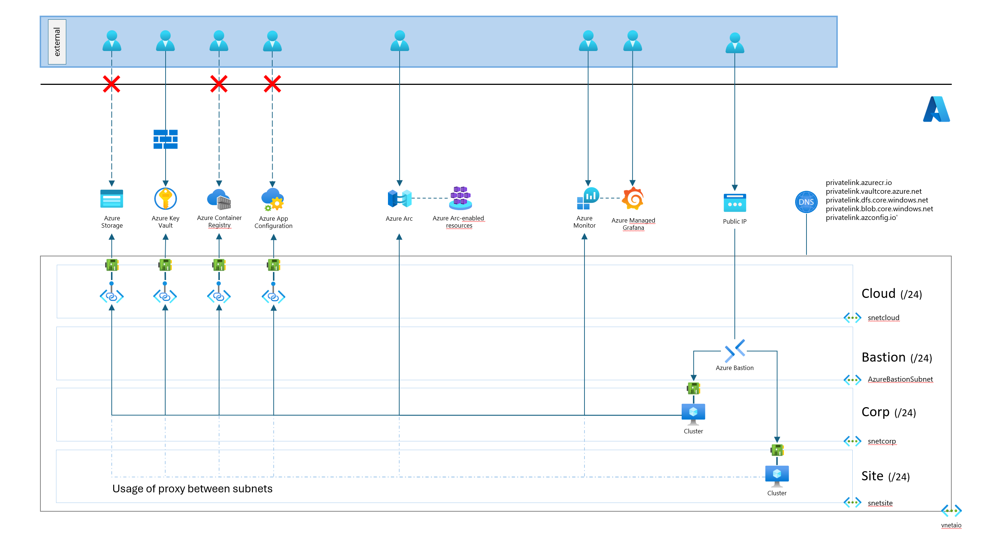

# Infrastructure Fundamentals

## Context

This document outlines the infrastructure fundamentals with key components installed by Bicep configuration files. The infrastructure is intended to support a secure and maintainable environment for our applications.

The purpose of this project is to install Azure Arc and IoT Operations in a simulated ISA-95 environment, with L3 (site/factory layer) and L4 (corp layer). ISA-95 is an international standard for developing an automated interface between enterprise and control systems. It provides a framework for integrating business and manufacturing systems, ensuring seamless communication and data exchange across different levels of the organization.

## Infrastructure diagram



## Folder Structure

```txt
infrastructure/
└─ bicep/
    ├─ environments/
    │  └─ development/
    │    ├─ clusters.json
    │    ├─ common.json
    │    ├─ fundamentals.json
    │    ├─ network.json
    │    └─ proxies.json
    ├─ modules/
    │  ├─ roles/
    │  │  ├─ ...
    │  │  └─ signedInUserRoleAssignments.bicep
    │  ├─ ...
    │  ├─ virtualMachineCluster.bicep
    │  └─ virtualMachineProxy.bicep
    ├─ workloads/
    │  ├─ cloud/
    │  │  └─ main.bicep
    │  ├─ corp/
    │  │  ├─ cluster.bicep
    │  │  └─ proxy.bicep
    │  ├─ network/
    │  │  └─ main.bicep
    │  └─ site/
    │     ├─ cluster.bicep
    │     └─ proxy.bicep
    ├─ clusters.bicep
    ├─ fundamentals.bicep
    └─ proxies.bicep
```

### Bicep parameters files

The environments folder contains configuration settings necessary for deploying the solution. These settings are stored in `.json` files and adhere to the Resource Manager parameter file schema. For more detailed information, please refer to the [documentation](https://learn.microsoft.com/en-us/azure/azure-resource-manager/templates/parameter-files).

At this stage of the project, the `environments` folder contains settings only for `development`environment. In the future, a similar structure can be replicated for other environments as needed.

### Bicep configuration files

The `bicep` folders contain the Bicep configuration files needed to deploy the solution. The subsequent section provides a comprehensive list of the installed resources.

## Workloads

### Network

Add the networking foundation by setting up Virtual Network, Subnets, Network Security Groups and Bastion Host. Is completed by proxies to restrict communication between layers.

| Subnet name         | CIDR | Description                                                                                                          |
|---------------------|------|----------------------------------------------------------------------------------------------------------------------|
| `AzureBastionHost`  | /24  | Reserved subnet used for [Azure Bastion](https://learn.microsoft.com/en-us/azure/bastion/bastion-overview) solution. |
| `snetcloud{suffix}` | /24  | Contains fundamentals resources (key vault, acr, storage) configured with private endpoints.                         |
| `snetcorp{suffix}`  | /24  | Contains virtual machine (hosting k3s) accessible only using Azure Bastion.                                          |
| `snetsite{suffix}`  | /24  | Contains virtual machine (hosting k3s) accessible only using Azure Bastion.                                          |

#### Azure Bastion

[Azure Bastion](https://learn.microsoft.com/en-us/azure/bastion/bastion-overview) provides secure RDP and SSH connectivity to all of the VMs in the virtual network for which it's provisioned.
Using Azure Bastion protects your virtual machines from exposing RDP/SSH ports to the outside world, while still providing secure access using RDP/SSH.


### Cloud Infrastructure

#### Resources

Add the following resources:

| Resource name           | Description                                                                                                                                                                                                                       |
|-------------------------|-----------------------------------------------------------------------------------------------------------------------------------------------------------------------------------------------------------------------------------|
| `Key Vault`             | [Azure Key Vault](https://learn.microsoft.com/en-us/azure/key-vault/general/overview) is a cloud service for securely storing and accessing secrets.                                                                              |
| `App Configuration`     | [Azure App Configuration](https://learn.microsoft.com/en-us/azure/azure-app-configuration/overview) provides a service to centrally manage application settings and feature flags                                                 |
| `Storage Account`       | Storage account configured as [Data Lake](https://learn.microsoft.com/en-us/azure/storage/blobs/data-lake-storage-introduction) with hierachical namespace to host schema registry.                                               |
| `Container Registry`    | [Azure Container Registry](https://learn.microsoft.com/en-us/azure/container-registry/container-registry-intro) is a managed registry service based on the open-source Docker Registry 2.0.                                       |
| `Azure Monitor`         | [Azure Monitor](https://learn.microsoft.com/en-us/azure/azure-monitor/overview) is a comprehensive monitoring solution for collecting, analyzing, and responding to monitoring data from your cloud and on-premises environments. |
| `Azure Managed Grafana` | [Azure Managed Grafana](https://learn.microsoft.com/en-us/azure/managed-grafana/overview) is a data visualization platform built on top of the Grafana software by Grafana Labs.                                                  |

#### Private Endpoints

`Key Vault`, `App Configuration`, `Storage Account`, and `Container Registry` are configured with private endpoints to restrict access to these resources within the Virtual Network (VNet).

> **Note:** The private endpoint for the storage account prevents the use of the schema registry in dataflows. Please disable this option if you need to use this feature.

Public network access is disabled for App Configuration, the Storage Account and the Container Registry. However, the Key Vault requires public access during the deployment setup to store keys from the deployment scripts. This access is restricted by a firewall. Additionally, public access is necessary to use Azure Bastion from the portal and securely access RDP/SSH keys.

Private DNS Zones are also enabled to resolve the fully qualified domain name (FQDN) of these resources within your private network.

| Resource type        | Subresource         | Private DNS Zone name             |
|----------------------|---------------------|-----------------------------------|
| `Key Vault`          | vault               | privatelink.vaultcore.azure.net   |
| `App Configuration`  | configurationStores | privatelink.azconfig.io           |
| `Storage Account`    | dfs                 | privatelink.dfs.core.windows.net  |
| `Storage Account`    | blob                | privatelink.blob.core.windows.net |
| `Container Registry` | registry            | privatelink.azurecr.io            |

For additional information about these Private DNS zone names and their configuration, please refer to [Azure Private Endpoint DNS configuration](https://learn.microsoft.com/en-us/azure/private-link/private-endpoint-dns).

### Corp Infrastructure

A Virtual Machine (Ubuntu 22.04) has been configured to support the following resources:

- Kubernetes (k3s distribution)
- Azure Arc agents deployed to the cluster
- Azure IoT operations

Additionally, a supplementary Vitual Machine has been provisioned to serve as a proxy between the subnet `snetcloud` and `snetcorp`.

Azure Bastion facilitates RDP/SSH connections to your Azure VM using its private IP address, eliminating the need for a public IP address on your virtual machine.

The size and image reference of these machines can be updated using the settings. The auto-shutdown feature, which is enabled by default, can also be configured in the same way.

### Site Infrastructure

A Virtual Machine (Ubuntu 22.04) has been configured to support the following resources:

- Kubernetes (K3S distribution)
- Azure Arc agents deployed to the cluster
- Azure IoT operations

Additionally, a supplementary Vitual Machine has been provisioned to serve as a proxy between the subnet `snetsite` and `snetcorp`.

Azure Bastion facilitates RDP/SSH connections to your Azure VM using its private IP address, eliminating the need for a public IP address on your virtual machine.

The size and image reference of these machines can be updated using the settings. The auto-shutdown feature, which is enabled by default, can also be configured in the same way.
